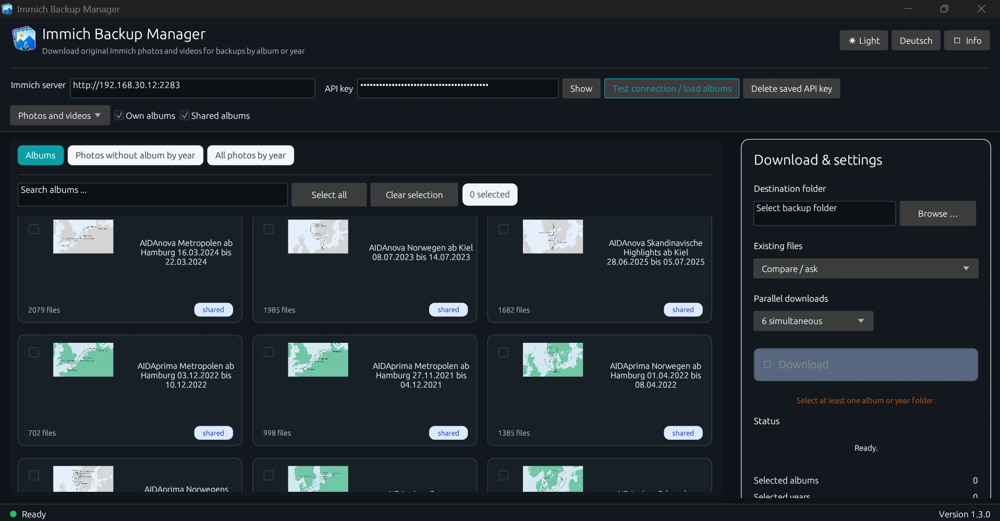
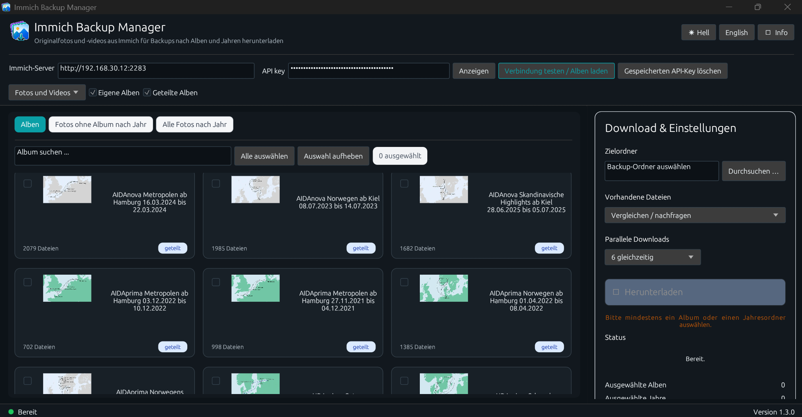
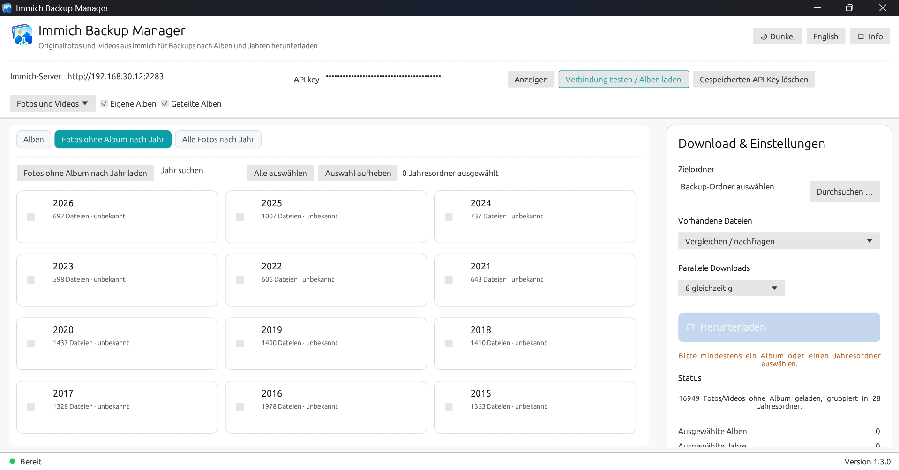
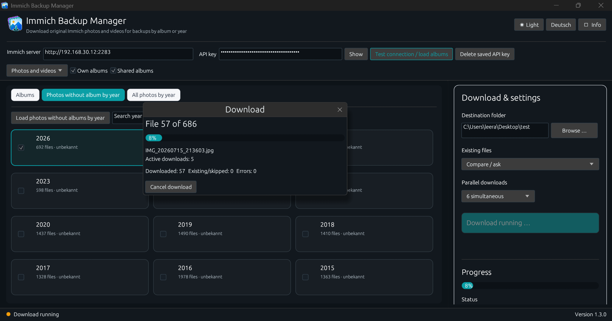
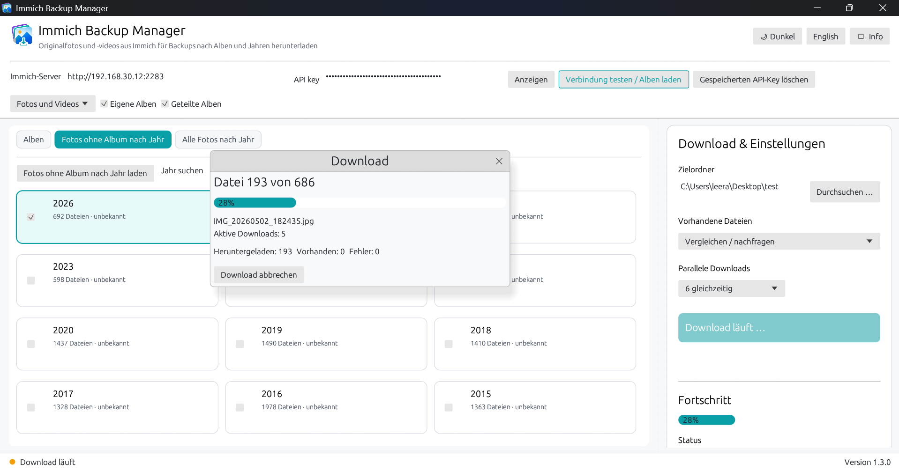

# Immich Backup Manager

**Version 1.3.0**

A Windows application for downloading original photos and videos from an Immich server by album or year.

> Immich Backup Manager is an independent freeware project and is not affiliated with or endorsed by the official Immich project.

---

# English

## Features

- Download personal and shared Immich albums
- Display album thumbnails directly from Immich
- Download photos and videos without an album, grouped by year
- Download all photos and videos, grouped by year
- Select multiple albums or year folders at once
- Save original files without creating ZIP archives
- Run multiple downloads in parallel
- Compare existing files and handle conflicts
- Automatically skip already complete files of the same size
- Cancel running downloads
- Store the server address and API key locally
- Delete the saved API key directly from the application
- Switch between Light Mode and Dark Mode
- Switch between English and German

## Preview

### 1. Album overview — Dark Mode, English

Browse and select personal or shared Immich albums in the modern Dark Mode interface.

### 2. Album overview — Dark Mode, German

The album overview with the complete German user interface.

### 3. Photos without albums by year — Light Mode

Photos and videos not assigned to an album are grouped by year and can be downloaded selectively.

### 4. Download in progress — Dark Mode

Live download progress with the current file, percentage, active downloads and statistics.

### 5. Download in progress — Light Mode

The same download process in Light Mode with live status and progress information.

## Build on Windows

1. Install Rust using `rustup`.
2. Download or clone this repository.
3. Run `BUILD.cmd`.
4. The finished executable is created as `Immich Backup Manager.exe`.

## Privacy

The API key is stored only in the local Windows user profile:

`%APPDATA%\Immich_Backup_Manager\settings.json`

The saved API key can be deleted from within the application at any time. It is not sent to the developer or to third-party servers.

## Freeware and rights

This software is freeware and may be used free of charge.

Copyright © 2026 Ralf Ebert. All rights reserved.

The source code is published for transparency and traceability. Without prior written permission from Ralf Ebert, the following are not permitted:

- Selling the software
- Publishing modified versions
- Redistributing modified source code
- Renaming and publishing the software under a different name
- Commercial exploitation of the software or any part of it

Use of the software is at your own risk. No liability is accepted for data loss, incomplete backups, incorrect operation or resulting damages.

---

# Deutsch

## Funktionen

- Eigene und geteilte Immich-Alben herunterladen
- Albumvorschaubilder direkt aus Immich anzeigen
- Fotos und Videos ohne Album nach Jahren gruppiert herunterladen
- Alle Fotos und Videos nach Jahren gruppiert herunterladen
- Mehrere Alben oder Jahresordner gleichzeitig auswählen
- Originaldateien ohne ZIP-Archiv sichern
- Mehrere Dateien parallel herunterladen
- Vorhandene Dateien vergleichen und Konflikte behandeln
- Bereits vollständige Dateien gleicher Größe automatisch überspringen
- Laufende Downloads abbrechen
- Serveradresse und API-Key lokal speichern
- Gespeicherten API-Key direkt im Programm löschen
- Zwischen Hell- und Dunkelmodus wechseln
- Zwischen Deutsch und Englisch wechseln

## Vorschau

### 1. Albumübersicht — Dark Mode, Englisch

Eigene und geteilte Immich-Alben in der modernen Dark-Mode-Oberfläche durchsuchen und auswählen.

### 2. Albumübersicht — Dark Mode, Deutsch

Die Albumübersicht mit vollständig deutscher Benutzeroberfläche.

### 3. Fotos ohne Album nach Jahr — Hellmodus

Fotos und Videos ohne Album werden nach Jahren gruppiert und können gezielt heruntergeladen werden.

### 4. Download läuft — Dark Mode

Live-Anzeige mit aktueller Datei, Fortschritt, parallelen Downloads und Statistiken.

### 5. Download läuft — Hellmodus

Der Downloadvorgang im Hellmodus mit Status- und Fortschrittsinformationen.

## Build unter Windows

1. Rust über `rustup` installieren.
2. Dieses Repository herunterladen oder klonen.
3. `BUILD.cmd` starten.
4. Die fertige Datei wird als `Immich Backup Manager.exe` erstellt.

## Datenschutz

Der API-Key wird ausschließlich lokal im Windows-Benutzerprofil gespeichert:

`%APPDATA%\Immich_Backup_Manager\settings.json`

Der gespeicherte API-Key kann jederzeit im Programm gelöscht werden. Er wird weder an den Entwickler noch an fremde Server übertragen.

## Freeware und Rechte

Dieses Programm ist Freeware und darf kostenlos genutzt werden.

Copyright © 2026 Ralf Ebert. Alle Rechte vorbehalten.

Der Quellcode wird zur Transparenz und Nachvollziehbarkeit veröffentlicht. Ohne vorherige schriftliche Genehmigung von Ralf Ebert sind insbesondere nicht erlaubt:

- Verkauf des Programms
- Veröffentlichung veränderter Versionen
- Weitergabe veränderter Quelltexte
- Umbenennung und Veröffentlichung unter anderem Namen
- Kommerzielle Verwertung des Programms oder einzelner Bestandteile

Die Nutzung erfolgt auf eigene Gefahr. Für Datenverlust, unvollständige Sicherungen, Fehlbedienung oder daraus entstehende Schäden wird keine Haftung übernommen.
