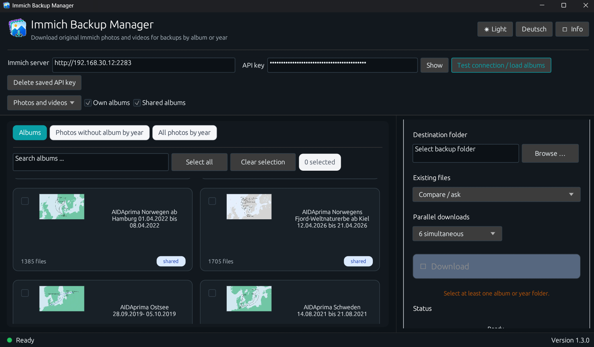
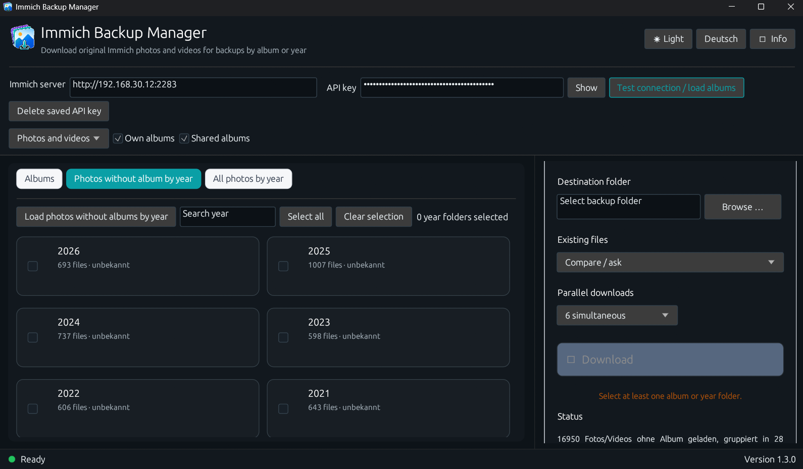
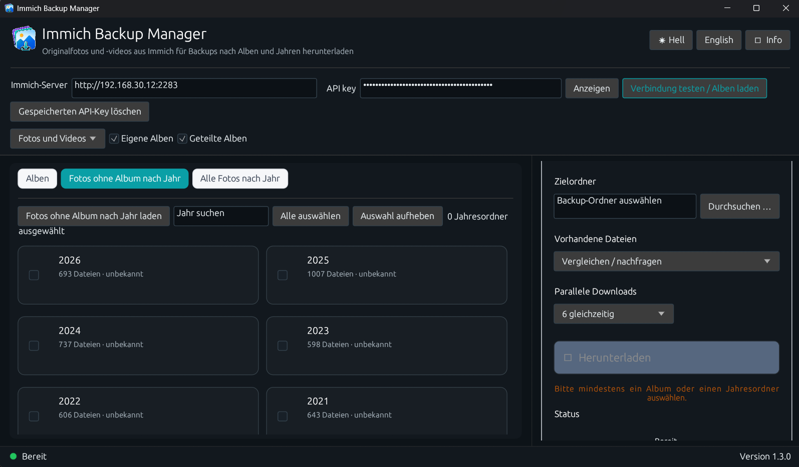
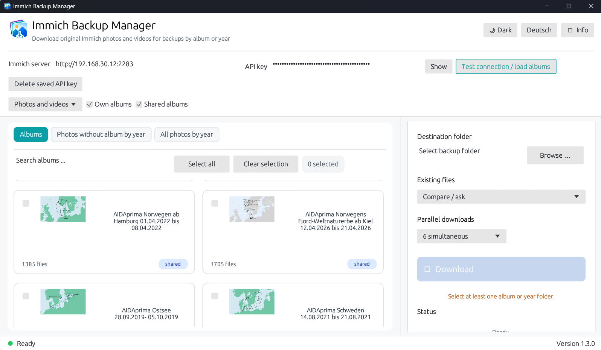
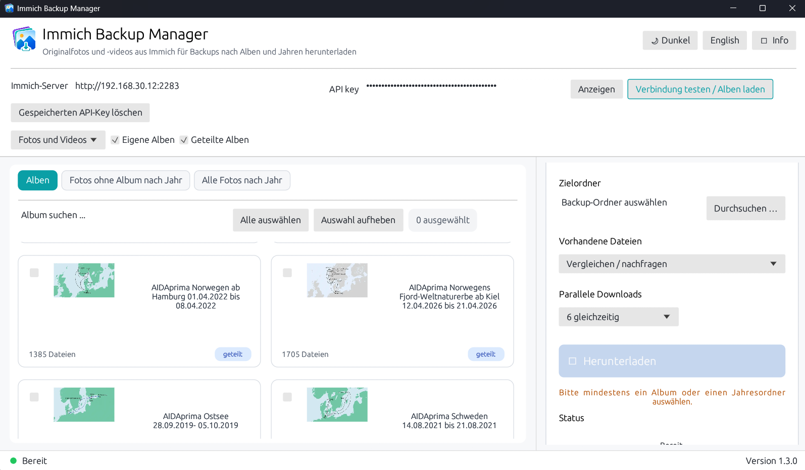
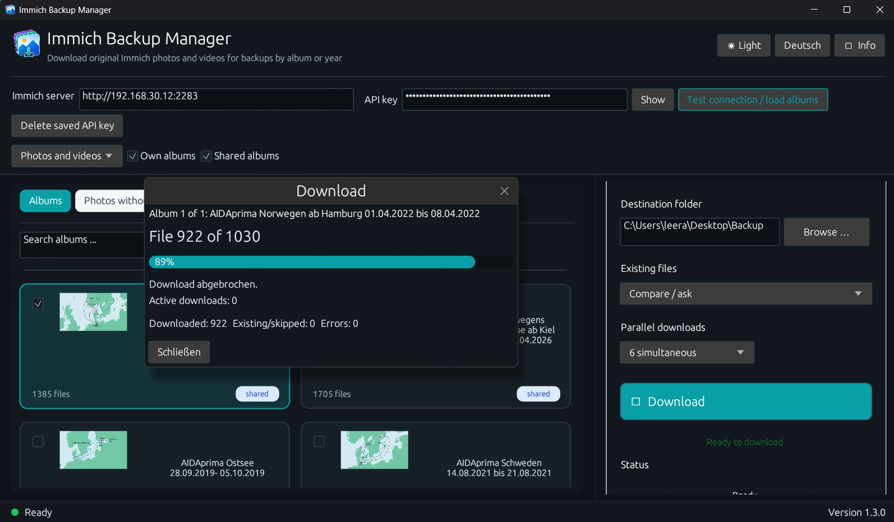
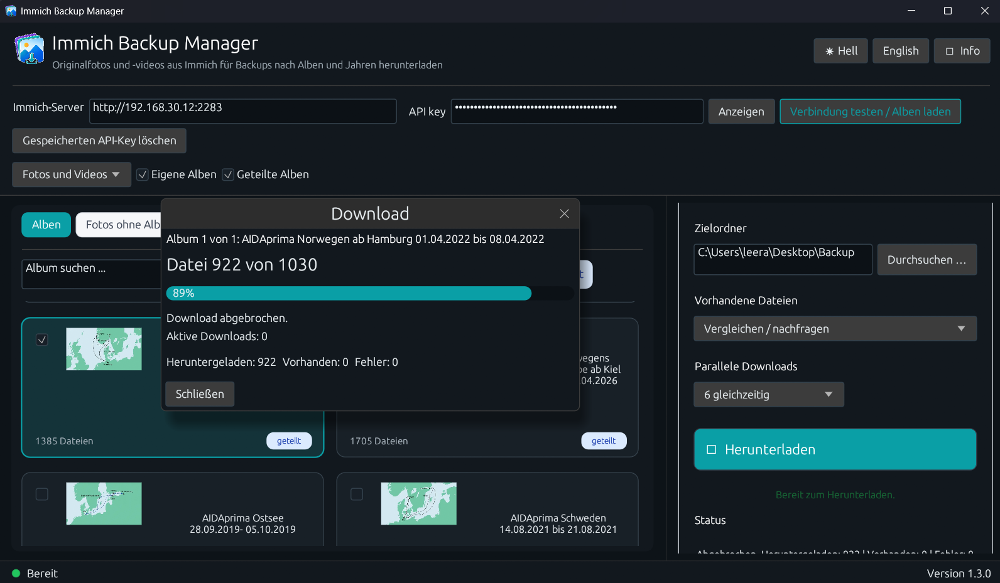

# Immich Backup Manager

<p align="center">
  
</p>

<p align="center">
  <strong>Windows utility for downloading and backing up original photos and videos from Immich.</strong><br>
  <strong>Windows-Hilfsprogramm zum Herunterladen und Sichern originaler Fotos und Videos aus Immich.</strong>
</p>

<p align="center">
  <a href="#english">English</a> · <a href="#deutsch">Deutsch</a> ·
  <a href="CHANGELOG.md">Changelog</a> · <a href="RELEASE_NOTES.md">Release notes</a> ·
  <a href="LICENSE">License</a>
</p>

> **Version 1.3.2 · Windows · Freeware · Copyright © 2026 Ralf Ebert · All rights reserved.**  
> Independent utility — not an official Immich product.

## Screenshots

### Dark Mode – Albums / Alben

| English | English compact |
|---|---|
|  |  |

### Year view / Jahresansicht

| English | Deutsch |
|---|---|
|  |  |

### Light mode / Hellmodus

| English | Deutsch |
|---|---|
|  |  |

### Download progress / Download-Fortschritt

| English | Deutsch |
|---|---|
|  |  |

---

<a id="english"></a>

# English

## Purpose of the program

**Immich Backup Manager 1.3.2** downloads original photos and videos from a self-hosted Immich installation. It supports complete albums, media without an album grouped by year, and all media grouped by year. Existing files can be skipped, overwritten, or reviewed in a dedicated comparison window.

## Main features

- Connect to a self-hosted Immich server using its address and an API key
- Download personal and shared albums
- Download photos and videos without an album, grouped by year
- Download all photos and videos, grouped by year
- Select multiple albums or year folders
- Store original files without an additional ZIP archive
- Use parallel downloads with a selectable number of simultaneous transfers
- Display album, file, error, and progress information
- Cancel running downloads
- Compare existing local files with Immich files
- Automatically skip files that are already complete
- Optionally overwrite existing files directly
- Manage duplicates in a dedicated window
- Use equal-sized comparison panels and preview areas
- Correct EXIF orientation for local previews
- Use a German or English interface
- Use dark mode or light mode

## API-key encryption and privacy

The Immich API key is stored locally using the **Windows Data Protection API (DPAPI)**. The encrypted value is bound to the current Windows user account and normally cannot be decrypted by another Windows account or on another computer.

The settings file is stored at:

```text
%APPDATA%\Immich_Backup_Manager\settings.json
```

Plaintext settings created by version 1.3.1 are automatically migrated to DPAPI encryption on the first start of version 1.3.2. The saved API key can be deleted from within the application at any time.

The program uses the API key only to connect to the Immich server address entered by the user. It does not send the key to the developer or to unrelated third-party servers. The settings file should nevertheless not be shared or uploaded publicly.

## Existing files and duplicate management

In **Compare / ask** mode, different versions are displayed side by side. Where available, the duplicate manager shows the preview, filename, capture time, file size, resolution, and storage location.

In **Direct overwrite** mode, existing files are replaced without further confirmation. Files that are already complete can be skipped automatically.

## Requirements

- Windows 10 or Windows 11
- Reachable Immich installation
- Valid Immich API key
- Write access to the selected destination folder

## Usage

1. Enter the Immich server address.
2. Enter the API key.
3. Select **Test connection / load albums**.
4. Select albums or year folders.
5. Choose the destination folder.
6. Select how existing files should be handled.
7. Select the number of parallel downloads.
8. Start **Download**.

## Build on Windows

1. Install Rust using `rustup`.
2. Clone or download the repository.
3. Run `BUILD.cmd`.
4. The finished executable is created as `Immich Backup Manager.exe` in the project folder or under `target\release`.

Alternatively:

```powershell
cargo build --release
```

## Important backup notice

After every major backup, verify that the expected files are present and readable. This application does not replace an additional, regularly tested backup strategy.

---

<a id="deutsch"></a>

# Deutsch

## Zweck des Programms

Der **Immich Backup Manager 1.3.2** lädt Originalfotos und Originalvideos aus einer eigenen Immich-Installation herunter. Unterstützt werden vollständige Alben, Medien ohne Album nach Jahr sowie alle Medien nach Jahr. Bereits vorhandene Dateien können übersprungen, überschrieben oder in einem eigenen Vergleichsfenster geprüft werden.

## Hauptfunktionen

- Verbindung mit einem eigenen Immich-Server per Serveradresse und API-Schlüssel
- Download eigener und geteilter Alben
- Download von Fotos und Videos ohne Album, gruppiert nach Jahr
- Download aller Fotos und Videos, gruppiert nach Jahr
- Auswahl mehrerer Alben oder Jahresordner
- Speicherung der Originaldateien ohne zusätzliches ZIP-Archiv
- Parallele Downloads mit einstellbarer Anzahl gleichzeitiger Übertragungen
- Anzeige von Album-, Datei-, Fehler- und Fortschrittsinformationen
- Abbruch laufender Downloads
- Vergleich vorhandener lokaler Dateien mit Immich-Dateien
- Automatisches Überspringen vollständig vorhandener Dateien
- Wahlweise direktes Überschreiben
- Duplikatverwaltung in einem eigenen Fenster
- Gleich große Vergleichsboxen und Vorschaubereiche
- EXIF-Korrektur für lokale Bildvorschauen
- Deutsche und englische Benutzeroberfläche
- Dark Mode und Light Mode

## API-Key-Verschlüsselung und Datenschutz

Der Immich-API-Key wird lokal mit der **Windows Data Protection API (DPAPI)** verschlüsselt gespeichert. Der verschlüsselte Wert ist an das aktuelle Windows-Benutzerkonto gebunden und kann normalerweise weder von einem anderen Windows-Konto noch auf einem anderen Computer entschlüsselt werden.

Die Einstellungsdatei befindet sich hier:

```text
%APPDATA%\Immich_Backup_Manager\settings.json
```

Unverschlüsselte Einstellungen aus Version 1.3.1 werden beim ersten Start von Version 1.3.2 automatisch auf DPAPI-Verschlüsselung umgestellt. Der gespeicherte API-Key kann jederzeit direkt im Programm gelöscht werden.

Das Programm verwendet den API-Key ausschließlich für die Verbindung mit der vom Benutzer eingetragenen Immich-Adresse. Der Schlüssel wird nicht an den Entwickler oder an fremde Drittserver übertragen. Die Einstellungsdatei sollte trotzdem nicht weitergegeben oder öffentlich hochgeladen werden.

## Vorhandene Dateien und Duplikatverwaltung

Im Modus **Vergleichen / nachfragen** werden unterschiedliche Versionen nebeneinander angezeigt. Soweit verfügbar, zeigt die Duplikatverwaltung Vorschau, Dateiname, Aufnahmezeit, Dateigröße, Auflösung und Speicherort.

Im Modus **Direkt überschreiben** werden vorhandene Dateien ohne weitere Nachfrage ersetzt. Bereits vollständig vorhandene Dateien können automatisch übersprungen werden.

## Voraussetzungen

- Windows 10 oder Windows 11
- Erreichbare Immich-Installation
- Gültiger Immich-API-Schlüssel
- Schreibzugriff auf den ausgewählten Zielordner

## Verwendung

1. Immich-Serveradresse eintragen.
2. API-Schlüssel eintragen.
3. **Verbindung testen / Alben laden** auswählen.
4. Alben oder Jahresordner auswählen.
5. Zielordner festlegen.
6. Verhalten für vorhandene Dateien auswählen.
7. Anzahl paralleler Downloads festlegen.
8. **Herunterladen** starten.

## Build unter Windows

1. Rust über `rustup` installieren.
2. Repository klonen oder herunterladen.
3. `BUILD.cmd` ausführen.
4. Die fertige Datei wird als `Immich Backup Manager.exe` im Projektordner beziehungsweise unter `target\release` erstellt.

Alternativ:

```powershell
cargo build --release
```

## Wichtiger Backup-Hinweis

Nach jeder größeren Sicherung sollte geprüft werden, ob die erwarteten Dateien vollständig vorhanden und lesbar sind. Das Programm ersetzt kein zusätzliches, regelmäßig geprüftes Backup-Konzept.

---

## Version history / Versionsverlauf

See [CHANGELOG.md](CHANGELOG.md).  
Siehe [CHANGELOG.md](CHANGELOG.md).

## Release notes

See [RELEASE_NOTES.md](RELEASE_NOTES.md).  
Siehe [RELEASE_NOTES.md](RELEASE_NOTES.md).

## License / Lizenz

This project uses a custom freeware license. The source code is publicly visible, but it is not released under an open-source license that permits unrestricted modification and redistribution. Only the [LICENSE](LICENSE) file is legally authoritative.

Dieses Projekt verwendet eine eigene Freeware-Lizenz. Der Quellcode ist öffentlich einsehbar, aber nicht als Open-Source-Lizenz zur freien Veränderung und Weiterverbreitung freigegeben. Maßgeblich ist ausschließlich die Datei [LICENSE](LICENSE).

**Copyright © 2026 Ralf Ebert. All rights reserved. / Alle Rechte vorbehalten.**
